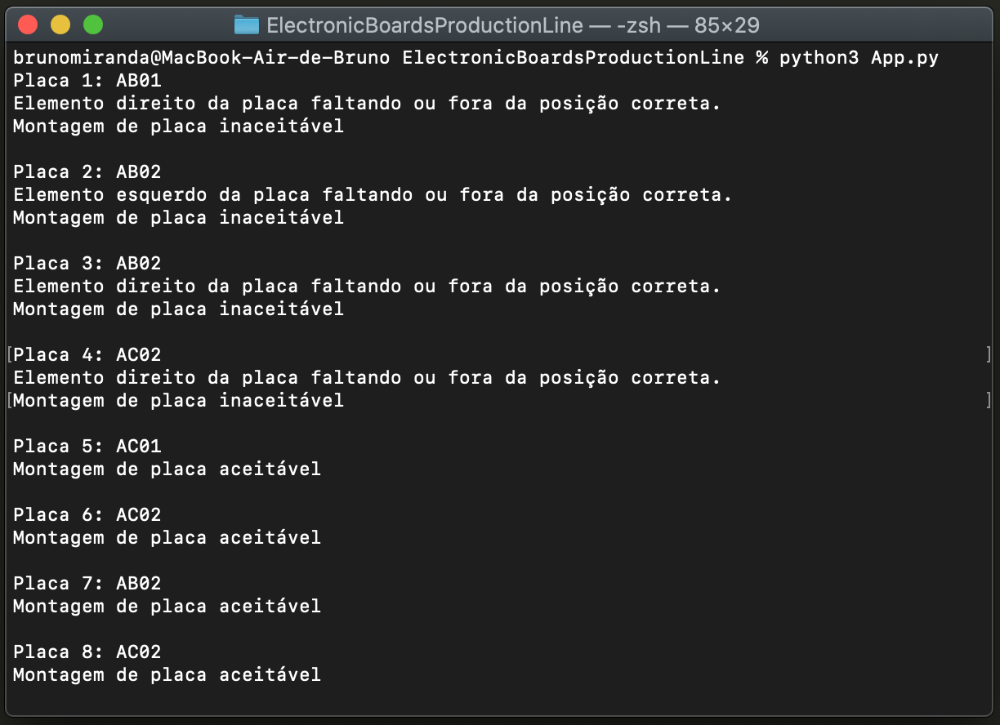
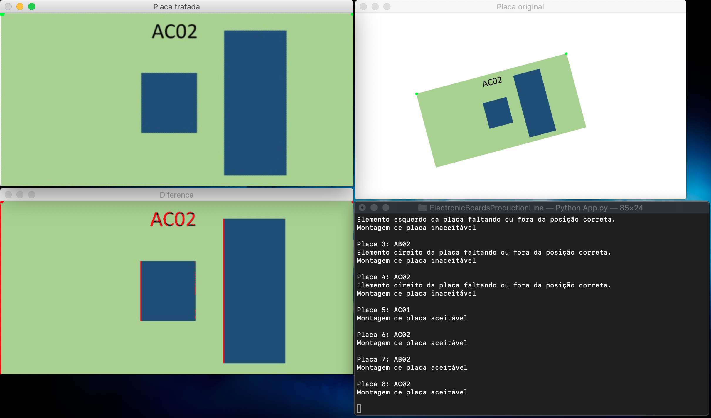
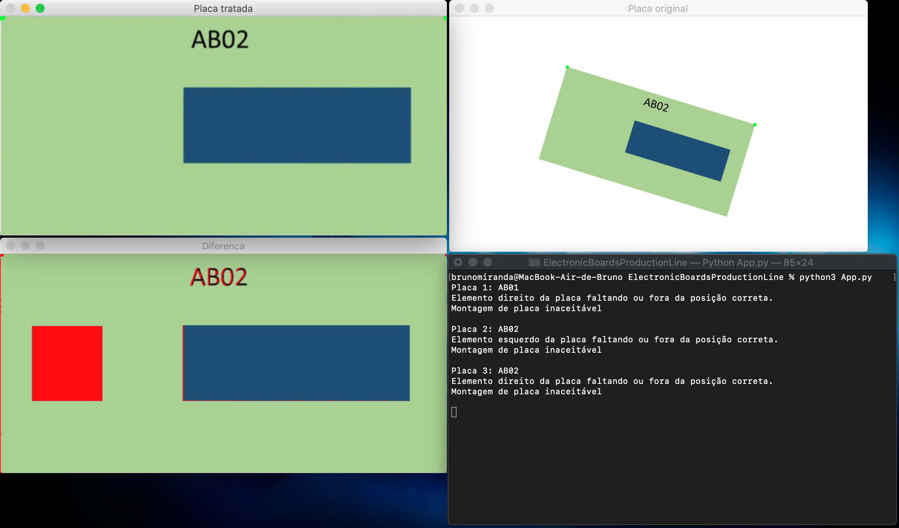

## Electronic Boards Production Line

This is a templates recognition and comparison application for a simulation of an electronic board production line.
The application is based on the OpenCV and PyTesseract modules.

A list of drawings representing some electronic boards are given to the application in a list. They are repositioned and corrected, if needed (they can be tilted), and then the template of the board which is written in it is identified.
As the template is known, both boards are compared and the differences are highlighted in the current board in the red color (if there is any).
In the terminal, then, it is reported if the current analized board is acceptable ("aceitável") or not ("inaceitável").

Conforming board example:

Non-conforming board example:

